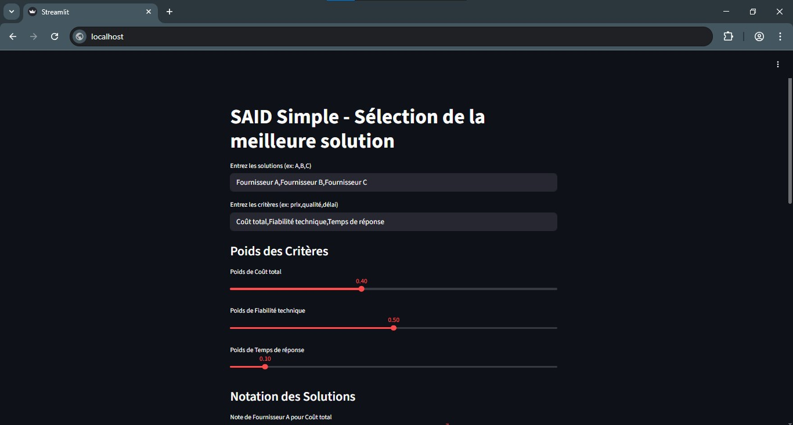

# SIAD - AHP Decision Support (Streamlit)

A simple **Decision Support System (SIAD)** web app built with **Streamlit** to rank alternatives using **AHP (Analytic Hierarchy Process)**.

This project helps you:
- Define **criteria** and **alternatives**
- Fill the **pairwise comparison matrix** (AHP)
- Compute **criteria weights**
- Check **Consistency Ratio (CR)**
- Enter **scores** for alternatives
- Get a final **ranking** and the best alternative

---

## 📁 Project Structure

```bash
siad-streamlit-ahp/
│-- app.py              # Streamlit UI (main application)
│-- ahp.py              # AHP functions (weights, CR, scoring)
│-- requirements.txt    # Python dependencies
│-- README.md           # Documentation
│-- .gitignore          # Ignored files for Git

## 📁 Requirements

Python 3.9+ recommended
pip (Python package manager)

## 🚀 To Run Locally

pip install -r requirements.txt
streamlit run app.py




